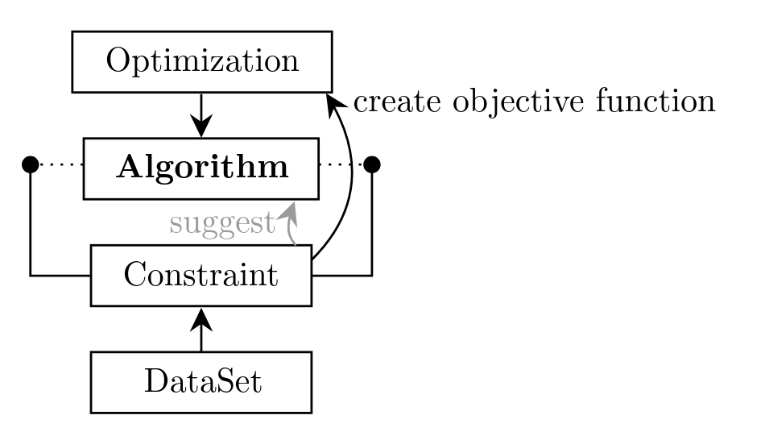

# PIONEER-Backend

## Design guidelines
- we should develop a library that is easy and clean to code extensions inside

## Frontend
- should contain an automatic code generation for the stuff that users construct in the GUI
- this code is then executed at runtime in the backend
- provide help for custom code snippets
- automatic hyperparameter and algorithm suggestion model